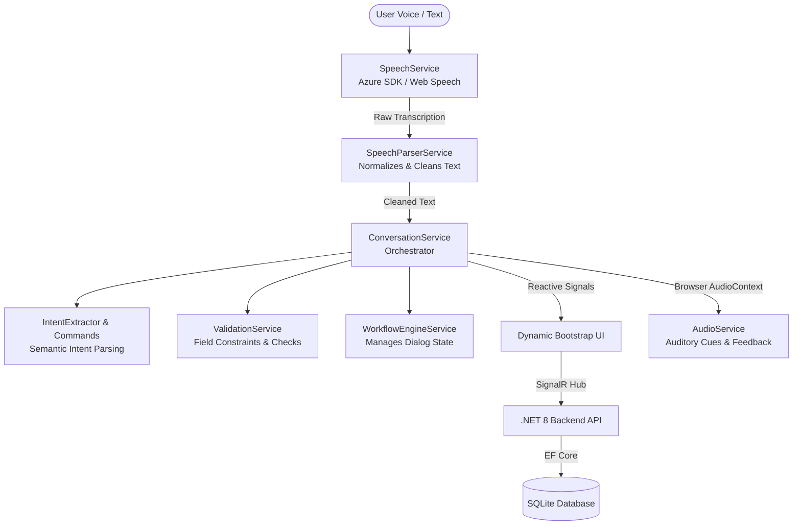

# 🎙️ Agentic Multilingual Voice Interface (AMVI)

The Agentic Multilingual Voice Interface (AMVI) is a lightweight, standalone proof-of-concept solution designed to enable hands-free and intelligent data entry in construction environments through voice interaction. Unlike basic speech-to-text systems, it focuses on understanding user intent, conversational context, and natural speech patterns to accurately populate structured form fields.

---

## 🏗️ System Architecture

AMVI features a decoupled architecture consisting of an **Angular 21 (PWA)** frontend shell and a **.NET 8 Web API** backend.



### 🧠 Core Frontend Services
* **`SpeechService`**: Manages the continuous microphone stream using `window.SpeechRecognition` (with automatic fallback to Azure Speech SDK). Handles noise resilience, auto-reconnects, and session lifecycles.
* **`SpeechParserService`**: Sanitizes input by stripping filler words (e.g., *"uh"*, *"like"*) and normalizing spoken numbers into numerical formats.
* **`IntentExtractorService` & `ConversationalCommandService`**: Interprets natural phrasing into structured form values, handles global commands (e.g., *"skip"*, *"clear"*, *"repeat"*), and manages out-of-order field overrides (e.g., *"No, I meant Site A1"*).
* **`ValidationService`**: Validates each field using strict rules appropriate for construction workflows (e.g., validating site code format, age limits, experience options).
* **`WorkflowEngineService`**: Directs the conversational thread, determining the next prompt, managing retry loops when inputs fail validation, and detecting completion cues (e.g., *"done"*, *"that's it"*).
* **`AudioService`**: Synthesizes custom micro-feedback tones using browser-native `AudioContext` (e.g., success chime, error buzz, correction sound) so users get auditory confirmations without having to look at the screen.

---

## 🛠️ Technology Stack

| Layer | Technology | Role |
| :--- | :--- | :--- |
| **Frontend** | Angular 21 (PWA) | Modular, Reactive Shell using Signals & Standalone Components |
| **Backend** | .NET 8 Web API | Core Application API Services |
| **Real-Time** | SignalR | Low-latency duplex streaming of transcripts |
| **Cloud AI** | Azure Speech & Translator | Robust multilingual translation & STT |
| **Database** | SQLite + EF Core 8 | Relational database persistence |
| **Styling** | Bootstrap 5 + SCSS | Mobile-first responsive layouts |

---

## 📋 Required Software & Prerequisites

Before setting up the project, make sure the following are installed:

| Tool | Recommended Version | Verify Command |
| :--- | :--- | :--- |
| **Node.js** | `v24+` | `node -v` |
| **npm** | `v11+` | `npm -v` |
| **Angular CLI** | `v21+` | `ng version` |
| **.NET SDK** | `v8+` | `dotnet --version` |
| **Git** | `Latest` | `git --version` |

---

## 🚀 Setup & Installation (Step-by-Step)

Follow these steps to set up the workspace from scratch:

### 1. Clone & Prepare Directory
```bash
git clone https://github.com/kizunasoftwaresolutions/Interactive-Module---AMVI.git
cd Interactive-Module---AMVI
git init
```

### 2. Angular Frontend Setup
1. **Navigate into the frontend project:**
   ```bash
   cd frontend
   ```
2. **Install Angular dependencies:**
   ```bash
   npm install
   ```
   *(This installs core packages, SignalR, Azure Speech SDK, Bootstrap, and PWA configurations.)*

3. **Verify the frontend builds successfully:**
   ```bash
   ng serve
   ```
   *Open [http://localhost:4200](http://localhost:4200) to see the running voice-assisted UI dashboard.*

### 3. .NET Backend Setup
1. **Navigate to the backend project from the root:**
   ```bash
   cd ../backend
   ```
2. **Restore NuGet packages:**
   ```bash
   dotnet restore
   ```
   *(Installs EF Core SQLite, Azure Speech, Azure Translator, and SignalR client libraries.)*

3. **Verify backend builds & runs:**
   ```bash
   dotnet run
   ```
   *The Web API will launch and listen on `http://localhost:5020`.*

---

## 🏃‍♂️ Running the Application

To run the complete system locally, open two separate terminals from the repository root:

### Terminal 1: Start Frontend
```bash
cd frontend
ng serve
```
* Access the interface at **[http://localhost:4200](http://localhost:4200)**.

### Terminal 2: Start Backend
```bash
cd backend
dotnet run
```
* Backend API endpoints are hosted at **[http://localhost:5020](http://localhost:5020)**.

---

## 📂 Recommended Project Structure

```text
Interactive-Module---AMVI/
│
├── frontend/
│   ├── src/
│   │   ├── app/
│   │   │   ├── models/        # Application data models & typescript interfaces
│   │   │   └── services/      # Core logic (Speech, Intent, Workflow, Audio, etc.)
│   │   └── environments/      # Environment config with Azure speech credentials
│   └── package.json
│
├── backend/
│   ├── Program.cs             # API routing and setup
│   └── backend.csproj         # NuGet dependencies (EF Core, Azure SDK)
│
├── database/                  # SQLite storage location
│
├── .gitignore
└── README.md
```

---

## 🗣️ How to Interact (Conversational Guidelines)

AMVI supports natural dialogue flow in both English and Japanese. The active field is highlighted on the UI dashboard in real time.

### 1. Guided Conversation Workflow (Happy Path)
* **System**: *"Welcome. Let's start. Say the Site Code."*
* **User**: *"site code is delta two three"* (System populates **Site Code: D-23**)
* **System**: *"What is your name?"*
* **User**: *"I am John Smith"* (System populates **Name: John Smith**)
* **System**: *"Select your age range. Under 18, eighteen to forty, or over forty?"*
* **User**: *"eighteen to forty"* (System populates **Age Range: 18-40**)
* **System**: *"How many years of experience do you have? None, one to five years, or more than five years?"*
* **User**: *"more than five"* (System populates **Experience: >5 years**)
* **System**: *"Are you a Site Manager? Yes or no?"*
* **User**: *"yes"* (System populates **Role: Site Manager**)
* **System**: *"Any additional notes or comments?"*
* **User**: *"Everything looks good here"* (System populates **Notes: Everything looks good here**)
* **System**: *"Everything is ready. Should I submit?"*
* **User**: *"Submit"* (System processes form submission and logs the result)

### 2. Conversational Commands & Corrections
You can say special commands at any point during the conversation:
* **Skip**: *"skip"* or *"skip question"* – Advances to the next empty field.
* **Repeat**: *"repeat"* or *"say again"* – Repeats the current prompt.
* **Clear**: *"clear"* or *"restart"* – Resets the form and restarts the flow.
* **Edit Specific Field**: *"change my name to Sarah"* or *"change site code to alpha seven"* – Automatically overrides the target field even if it isn't the active one, plays a correction sound, and returns to the active field.

---

## 🚦 Current Development Status

| Component | Status | Key Accomplishments |
| :--- | :---: | :--- |
| **Reactive State Engine** | ✅ Completed | Form state management and tracking powered entirely by Angular Signals |
| **Speech Processing** | ✅ Completed | Continuous speech recognition with fallback, including real-time interim result support |
| **Intent Extraction** | ✅ Completed | Text normalizer to remove filler words and map natural spoken entries to form values |
| **Conversational Rules** | ✅ Completed | Rules for Skip, Repeat, Out-of-turn corrections, and final confirmation checks |
| **UI Audio Feedback** | ✅ Completed | Synthesis of micro-feedback tones via browser-native AudioContext |
| **Narrative Generator** | ✅ Completed | Smart generation of readable paragraph summaries of entered data in real time |
| **API Scaffolding** | ✅ Completed | Created .NET 8 Web API project structure with core endpoints |
| **Database Migrations** | ⏳ In Progress | Configuring the SQLite database context and initial schema definitions |
| **Real-time Sync** | ⏳ In Progress | Preparing SignalR hubs to stream audio transcripts and telemetry from UI to backend |
| **Cloud Translation** | ⏳ In Progress | Integrating Azure Cognitive Services and Translator for noise-resilient multilingual transcription |

---

## 🔮 Next Development Phase (Backend & Cloud Integration)
1. **Azure Speech SDK Integration**: Connect the backend with Azure Speech and Translation keys to provide server-side transcription and localization.
2. **SignalR Hub Creation**: Stream UI state changes and real-time transcripts to the .NET API.
3. **Database Hookup**: Finalize the SQLite tables via EF Core Migrations:
   ```bash
   dotnet ef migrations add InitialCreate
   dotnet ef database update
   ```
4. **Localization UI Layer**: Add toggle controls to switch languages between English and Japanese natively.
